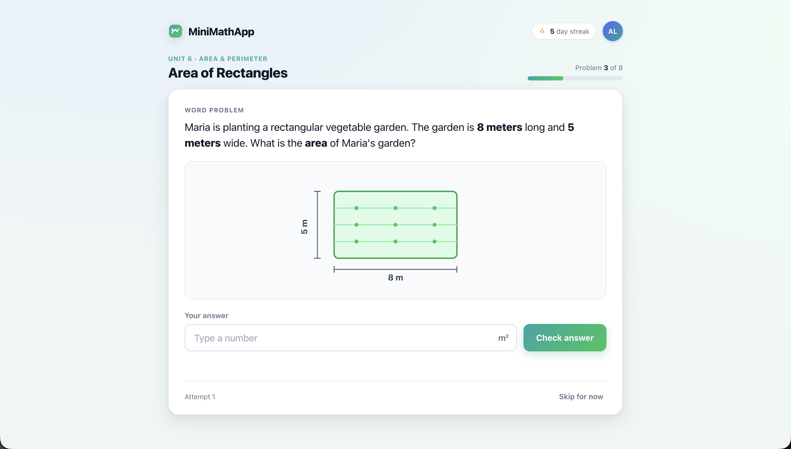

# AI Experiment Consultant

#### From an idea, pain point, or screenshot to an implementation-ready UpGrade experiment plan

PELE 2026 · Work-in-Progress / Demo

**Zack Lee and April Murphy**

Carnegie Learning

<!--
Hi everyone, I'm Zack Lee, a software engineer on the Research team at Carnegie Learning. This is joint work with April Murphy.

Today, I'll introduce AI Experiment Consultant, a prototype that helps educational software teams turn an app idea, a pain point, or a screenshot into an implementation-ready UpGrade experiment plan.

I'll start with the practical problem that motivated this work.
-->

---

# The onboarding problem

  <section class="cl-onboarding-stage cl-planning-stage">
    
Before the plan is clear

    <h2>The hard part often comes earlier.</h2>
    
A rough idea, pain point, or specific interaction still has to become a clear experiment plan.

    

      
<strong>What</strong> should we test?

      
<strong>Where</strong> does condition assignment happen?

      
<strong>Which</strong> conditions and metrics?

      
<strong>What</strong> needs to change in the app?

    

  </section>

  
→

  <section class="cl-onboarding-stage cl-upgrade-stage">
    
Once a clear plan exists

    <h2>UpGrade runs and manages the experiment</h2>
    
Carnegie Learning's open-source platform for educational A/B testing

  </section>

  Planning gap
  Today, turning an idea into that plan often requires <strong>expert consultation</strong>.

<!--
The practical problem is that teams often need support before they have a clear experiment plan.

In recent onboarding work with external EdTech teams, we saw that a team may have a rough idea, a pain point, or a specific interaction they want to improve, but still need to decide what to test, where condition assignment should happen, what the conditions and metrics should be, and what needs to change in the app.

Once that plan exists, UpGrade — Carnegie Learning's open-source platform for educational A/B testing — helps teams run and manage the experiment.

Today, that earlier planning step usually requires expert consultation. This project addresses that planning gap.
-->

---

# What it does

  

    
    
Input

    
An idea, a pain point, or a screenshot

  

  
→

  

    
    
Guided consultation

    
A web-based, <strong class="cl-nowrap">chat-driven</strong> consultant for educational software teams

  

  
→

  

    
    
Output

    
A concrete A/B test plan + an implementation-ready <strong>markdown report</strong> tailored to UpGrade

  

  Guiding principle
  <strong>Human-controlled and planning-focused</strong> — the tool suggests; the user decides.

<!--
AI Experiment Consultant is a web-based, chat-driven consultant for educational software teams.

The starting point can be an idea, a pain point, or a screenshot.

Through a guided consultation, the tool asks follow-up questions, suggests possible directions, and helps turn that input into a concrete A/B test plan.

The main output is an implementation-ready markdown report tailored to UpGrade, so the plan can be shared and acted on after the conversation.

Throughout the process, the tool remains human-controlled and planning-focused: it suggests options and structures the plan, but the user decides what to approve or change.
-->

---

# Six-phase consulting workflow

  

    
Context collection

    

      

        
01

        
Learning app

      

      
→

      

        
02

        
Page / problem / interaction

      

    

  

  
→

  

    
AI-guided planning

    

      

        
03

        
Hypothesis refinement

        
Optional research grounding

      

      

        ✓<b aria-hidden="true">→</b>
      

      

        
04

        
A/B test design

      

      

        ✓<b aria-hidden="true">→</b>
      

      

        
05

        
Synthetic preflight

        
Optional

      

    

  

  
→

  

    
Handoff

    

      
06

      
Report generation

    

  

  Approval gates
  The user approves every major transition.

<!--
The consultant follows a six-phase workflow, but to the user it still feels like a guided chat.

First, it asks about the learning app: what it does, who uses it, and what students are trying to learn.

Second, it asks about the specific page, problem, or interaction where an experiment might happen. A screenshot can help, but the user can also describe it in text.

Third, it helps turn the starting point into a testable hypothesis. This is where it can suggest possible interventions and outcome metrics, and also offer optional related research grounding.

Fourth, it translates the approved hypothesis into an UpGrade experiment design, including the decision point, conditions, and metrics.

Fifth, it can run an optional synthetic preflight using simulated participants. This is mainly meant to show what enrollment and metric data look like in UpGrade, not to provide evidence of learning effects.

Sixth, it generates the final markdown report.

The user approves every major transition before the tool moves on.
-->

---

# Why the report matters

  

    

      
      

        
Primary handoff

        <h2>Structured markdown report</h2>
      

    

    
Captures the complete experiment plan

    

      Hypothesis
      UpGrade experiment design
      Simulation summary
      Implementation guidance
    

  

  

    

      
One shared artifact

      
For researchers, developers, and product teams

    

    

      
Concrete specification

      
For later implementation work

    

  

<!--
Before the demo, I want to highlight the report as the main output, not just the last step in the chat.

The conversation ends as a structured markdown report. It pulls together the hypothesis, the UpGrade experiment design, the simulation summary, and step-by-step implementation guidance.

This makes the report a shared artifact. Researchers, developers, and product teams can use it to align on the experiment design and implementation plan.

And because it's plain markdown, it can also serve as a concrete spec for later implementation work. This can include work supported by AI coding tools, with a person still reviewing any resulting changes.
-->

---

# Live demo — MiniMathApp

  

    <section class="cl-demo-card cl-demo-scenario">
      
Demo scenario

      <h2>A fictional math-practice app</h2>
      
An area word problem about a rectangular garden

    </section>
    <section class="cl-demo-card cl-demo-pain-point">
      
Pain point

      <h2>Students often <strong>get stuck or answer incorrectly</strong> on the first try</h2>
    </section>
  

  <figure class="cl-demo-screen">
    
  </figure>

<!--
Now let's see this in a short demo. I'll use a fictional app called MiniMathApp — a simple math-practice app for middle-school students.

The screen shows an area word problem about a rectangular garden, with a diagram, an answer box, and a "Check answer" button. The team noticed that many students get stuck or answer incorrectly on the first try.

Notice that we haven't chosen an intervention yet. We'll start from this problem page and the pain point, and ask the consultant to help us plan an experiment.

Let's switch to the live demo.
-->

---
layout: iframe
url: http://localhost:5173/ai-consultant/login
scale: 0.8
---

<!--
====================================

MiniMathApp is a math practice app for middle-school students.

Many students get stuck or answer incorrectly on the first try on this area word-problem page.

We have not chosen an intervention yet. Please suggest a few A/B test ideas and recommend a good starting experiment.

====================================

So this is the login page. I'll sign in. (Click "Sign in as Zack")

Now we're in the chat. The consultant starts by asking about the learning app, so I'll share the MiniMathApp screenshot and a short description.

First, I'll upload the screenshot. (Click +, choose minimath-screenshot.png, Open)

Then I'll paste the description and send both together. (Paste prompt and send)

(After response) OK, it gave me three experiment ideas and recommended the first one: an optional hint button.

It also drafted a hypothesis about improving first-attempt correctness without substantially increasing time-on-task.

I'll accept that and move forward. (Type "yes" and send)

(After response) Now it asks whether I want to look for related research papers before creating the UpGrade experiment design.

I'll say yes here. (Type "yes" and send)

(While search_papers is running) Now it's looking for related research papers. Internally, it searches Semantic Scholar with a few different queries, collects up to 12 candidate papers, and then summarizes up to 3 relevant ones.

(After response) It found a few related papers with relevance notes and design implications.

(After reading suggested refinement) It also suggested a refinement. This sounds good to me, so I'll accept it.

I'll continue to the UpGrade experiment design. (Type "yes" and send)

(After response) Now it has turned the approved hypothesis into an UpGrade experiment design: where the experiment runs, what the conditions are, and which metrics we will track.

I could revise the details here, but for the demo, I'll accept this design. (Type "yes" and send)

(If it asks about the preflight simulation) Now it asks whether to run a preflight simulation with synthetic participants.

I'll say yes to run the simulation. (Type "yes" and send)

(While run_simulation is running) Now it is running a synthetic preflight. It creates a temporary UpGrade experiment, simulates 200 students going through the decision point, logs synthetic metric events, and then cleans everything up.

This is not testing real learners. It is a quick check of what assignment, enrollment, and metrics would look like in UpGrade.

(After response) Now we can see the preflight result: enrollment by condition, followed by metric summaries.

It also summarizes the synthetic result and reminds us that this is not evidence of a real learning effect.

Now it asks whether to generate the final report. I'll say yes so we can see the shared handoff artifact. (Type "yes" and send)

(While generate_report is running) This usually takes about 20 seconds.

The report pulls together the full plan: the app and page description, the hypothesis, the related research, the UpGrade experiment design, the simulation summary, and guidance for UpGrade setup, experiment creation, and client integration.

Any section can be excluded from the report, but for this demo I'm keeping everything in.

(After report opens) Now the final report opens in the side panel.

This is the main handoff artifact. It starts with the summary, the learning app, the page and problem, the experiment idea, and the hypothesis. (Scroll slowly)

It also includes the related research grounding, the UpGrade experiment design, and the simulation result summary. (Scroll)

Later sections are more implementation-focused. They give setup guidance, experiment creation steps, and client-integration guidance with code examples. (Scroll)

In practice, this report can be shared with the people who need to act on the plan. A researcher can review the design, a developer can use the integration guidance, and an AI coding tool could use the report as a starting spec, with a human still reviewing the work.

The report can be copied or downloaded from here. (Point to copy/download buttons)

(Return to the slides)
-->

---

# Scope today, future direction

  

    
Today

    <h2>Planning‑focused MVP</h2>
    
Simple UpGrade experiment designs

  

  
→

  

    
Fall 2026

    <h2>Real‑team evaluation</h2>
    
Planned during UpGrade onboarding

  

  
→

  

    
Future

    <h2>Human‑reviewed pipeline</h2>
    
An approved report connects planning, implementation, UpGrade setup, and analysis

  

  Guardrail
  <strong>Synthetic preflight</strong> demonstrates UpGrade mechanics, not evidence of learning effects.

<!--
Now I'll wrap up with the current scope and future direction.

Today, this is a planning-focused MVP, designed for simple UpGrade experiments such as one decision point with basic conditions and metrics. That's a deliberate choice for this prototype, not a limit of UpGrade.

One guardrail from the demo is that the synthetic preflight is mainly meant to show what enrollment and metric data look like in UpGrade, not to provide evidence of learning effects.

The next step is evaluation with real teams, which we haven't done yet. We plan to do that during Fall 2026 UpGrade onboarding.

Looking ahead, an approved report could become the shared input for a human-reviewed pipeline. AI and automation could help draft client-app changes, prepare the UpGrade configuration, and later support experiment analysis, with humans reviewing each step.

-->

---
layout: thanks
---

# Thank you

### Questions?

Try the app: <https://upgrade-demo.carnegielearning.com/ai-consultant>

Repository: <https://github.com/CarnegieLearningWeb/ai-experiment-consultant>

Contact: <zlee@carnegielearning.com>

<!--
Thanks for listening. I'm happy to take questions.
-->
