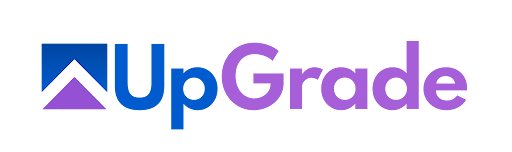

# AI Experiment Consultant

#### From an idea, a pain point, or a screenshot to an implementation-ready UpGrade experiment plan

PELE 2026 · Work-in-Progress / Demo

**Zack Lee and April Murphy**

Carnegie Learning

<!--
Hi everyone, I'm Zack Lee, a software engineer on the Research team at Carnegie Learning. This is joint work with April Murphy.

Today, I'll introduce AI Experiment Consultant, a prototype that helps educational software teams turn an idea, a pain point, or a screenshot into an implementation-ready UpGrade experiment plan.

(Skip UpGrade intro) I'll start with the practical problem that motivated this work.

(Do UpGrade intro) First, let me give a quick overview of UpGrade.
-->

---

# What is UpGrade?

  <section class="cl-upgrade-identity">
    
    
An <strong>open-source platform</strong> for configuring, deploying, and managing experiments in educational software.

    

      Used by Carnegie Learning + EdTech partners
      Hundreds of thousands of students
    

  </section>

  <section class="cl-upgrade-platform">
    

      
Experiment design in UpGrade

      

        Decision point
        Conditions
        Participants
        Metrics
      

    

    
Connected at runtime

    

      

        
Learning app

        <h2>Applies the experience</h2>
        
Requests an assignment at the decision point and logs outcomes

      

      

        
assignment request<b>→</b>

        
<b>←</b>condition

        
enrollment + metrics<b>→</b>

      

      

        
UpGrade

        <h2>Orchestrates the experiment</h2>
        
Manages assignment, enrollment, lifecycle, and data

      

    

  </section>

  Key boundary
  <strong>UpGrade orchestrates the experiment;</strong> the learning app implements the condition-specific experience.

<!--
(Skip UpGrade intro) I'll skip this UpGrade overview.

(Do UpGrade intro) UpGrade is Carnegie Learning's open-source platform for configuring, deploying, and managing experiments in educational software.

It's been used by Carnegie Learning and partner EdTech teams in experiments involving hundreds of thousands of students.

Experimenters use UpGrade to specify where an experiment runs, which conditions it includes, who can participate, and what outcomes to track. That location in the app is the decision point.

At runtime, the learning app sends an assignment request to UpGrade. UpGrade returns a condition, and the app applies the corresponding experience. The app then sends enrollment and outcome metrics back to UpGrade.

So the key boundary is: UpGrade orchestrates the experiment, while the learning app implements the condition-specific experience.
-->

---

# The onboarding problem

  <section class="cl-onboarding-stage cl-planning-stage">
    
Before the plan is clear

    <h2>The hard part often comes earlier.</h2>
    
A rough idea, pain point, or specific interaction still has to become a clear experiment plan.

    

      
<strong>What</strong> should we test?

      
<strong>Where</strong> does condition assignment happen?

      
<strong>Which</strong> conditions and metrics?

      
<strong>What</strong> needs to change in the app?

    

  </section>

  
→

  <section class="cl-onboarding-stage cl-upgrade-stage">
    
Once a clear plan exists

    <h2>UpGrade runs and manages the experiment</h2>
    
Carnegie Learning's open-source platform for educational A/B testing

  </section>

  Planning gap
  Today, turning an idea into that plan often requires <strong>expert consultation</strong>.

<!--
The hard part often comes before teams have a clear experiment plan.

In recent onboarding work with external EdTech teams, we've seen them come in with a rough idea, a pain point, or a specific interaction they want to improve, but without clear answers about what to test, where condition assignment should happen, which conditions and metrics to use, or what needs to change in the app.

Once that plan exists, UpGrade helps teams run and manage the experiment.

Today, that earlier planning step usually requires expert consultation. This project addresses that planning gap.
-->

---

# What it does

  

    
    
Input

    
An idea, a pain point, or a screenshot

  

  
→

  

    
    
Guided consultation

    
A web-based, <strong class="cl-nowrap">chat-driven</strong> tool for educational software teams

  

  
→

  

    
    
Output

    
A concrete A/B test plan + an implementation-ready <strong>markdown report</strong> tailored to UpGrade

  

  Guiding principle
  <strong>Human-controlled and planning-focused</strong> — the tool suggests; the user decides.

<!--
AI Experiment Consultant is a web-based, chat-driven tool for educational software teams.

The starting point can be an idea, a pain point, or a screenshot.

Through a guided consultation, the tool asks follow-up questions, suggests possible directions, and helps turn that input into a concrete A/B test plan.

The main output is an implementation-ready markdown report tailored to UpGrade, so the plan can be shared and acted on after the conversation.

Throughout the process, the tool remains human-controlled and planning-focused: it suggests options and structures the plan, but the user decides what to approve or change.
-->

---

# Six-phase consulting workflow

  

    
Context collection

    

      

        
01

        
Learning app

      

      
→

      

        
02

        
Page / problem / interaction

      

    

  

  
→

  

    
AI-guided planning

    

      

        
03

        
Hypothesis refinement

        
Optional research grounding

      

      

        ✓<b aria-hidden="true">→</b>
      

      

        
04

        
A/B test design

      

      

        ✓<b aria-hidden="true">→</b>
      

      

        
05

        
Synthetic preflight

        
Optional

      

    

  

  
→

  

    
Handoff

    

      
06

      
Report generation

    

  

  Approval gates
  The user approves every major transition.

<!--
The consultant follows a six-phase workflow, but to the user it still feels like a guided chat.

First, it asks about the learning app: what it does, who uses it, and what students are trying to learn.

Second, it asks about the specific page, problem, or interaction where an experiment might happen. A screenshot can help, but the user can also describe it in text.

Third, it helps turn the starting point into a testable hypothesis. This is where it can suggest possible interventions and outcome metrics, and also offer optional related research grounding.

Fourth, it translates the approved hypothesis into an UpGrade experiment design, including the decision point, conditions, and metrics.

Fifth, it can run an optional synthetic preflight using simulated participants. This is mainly meant to show what enrollment and metric data look like in UpGrade, not to provide evidence of learning effects.

Sixth, it generates the final markdown report.

The user approves every major transition before the tool moves on.
-->

---

# Why the report matters

  

    

      
      

        
Primary handoff

        <h2>Structured markdown report</h2>
      

    

    
Captures the complete experiment plan

    

      Hypothesis
      UpGrade experiment design
      Simulation summary
      Implementation guidance
    

  

  

    

      
One shared artifact

      
For researchers, developers, and product teams

    

    

      
Concrete specification

      
For later implementation work

    

  

<!--
Before the demo, I want to highlight the report as the main output, not just the last step in the chat.

The conversation ends as a structured markdown report. It pulls together the hypothesis, the UpGrade experiment design, the simulation summary, and step-by-step implementation guidance.

This makes the report a shared artifact. Researchers, developers, and product teams can use it to align on the experiment design and implementation plan.

And because it's plain markdown, it can also serve as a concrete spec for later implementation work. This can include work supported by AI coding tools, with a person still reviewing any resulting changes.
-->

---

# Live demo — MiniMathApp

  

    <section class="cl-demo-card cl-demo-scenario">
      
Demo scenario

      <h2>A fictional math-practice app</h2>
      
An area word problem about a rectangular garden

    </section>
    <section class="cl-demo-card cl-demo-pain-point">
      
Pain point

      <h2>Students often <strong>get stuck or answer incorrectly</strong> on the first try</h2>
    </section>
  

  <figure class="cl-demo-screen">
    
  </figure>

<!--
Now let's see this in a short demo. I'll use a fictional app called MiniMathApp — a simple math-practice app for middle-school students.

This page shows an area word problem about a rectangular garden, along with a diagram, an answer box, and a "Check answer" button. The team noticed that many students get stuck or answer incorrectly on the first try.

Notice that we haven't chosen an intervention yet. We'll start from this problem page and the pain point, and ask the consultant to help us plan an experiment.

Let's switch to the live demo.
-->

---
layout: iframe
url: http://localhost:5173/ai-consultant/login
scale: 0.8
---

<!--
So this is the login page. It also gives a quick overview of what the tool does. I'll sign in. (Click "Sign in as Zack")

Now we're in the chat. The consultant starts by asking about the learning app.

(Read) "To start, tell...is it for?"

There are also starter options if you're not sure where to begin.

I'll give it just the app-level context first.

(Paste/Read/Send)

  
MiniMathApp is a math practice app for middle-school students. Students work through one problem at a time in topic-based practice units.
  
  <button type="button" class="cl-note-copy-button" title="Copy prompt" aria-label="Copy prompt" onclick="navigator.clipboard.writeText(this.previousElementSibling.innerText.trim()).then(() => { this.classList.add('is-copied'); this.title = 'Copied'; window.setTimeout(() => { this.classList.remove('is-copied'); this.title = 'Copy prompt'; }, 1000); })">⧉✓</button>

(After response) And it says:

(Read) "Thanks. Which page...if you have one."

So I'll upload the screenshot (Upload minimath-screenshot.png)

Then I'll paste the page description and the pain point.

(Paste/Read/Send)

  
This is an area word-problem page about a rectangular garden. Many students get stuck or answer incorrectly on the first try.  We have not chosen an intervention yet. Please suggest a few A/B test ideas and recommend a good starting experiment.
  
  <button type="button" class="cl-note-copy-button" title="Copy prompt" aria-label="Copy prompt" onclick="navigator.clipboard.writeText(this.previousElementSibling.innerText.trim()).then(() => { this.classList.add('is-copied'); this.title = 'Copied'; window.setTimeout(() => { this.classList.remove('is-copied'); this.title = 'Copy prompt'; }, 1000); })">⧉✓</button>

(After response) Okay, it gives me three experiment ideas:

(Read) "Optional hint button...Scaffolded steps."

Then it recommends starting with the optional hint button:

(Read) "It is a small...who are stuck."

It also proposes a hypothesis:

(Read) "Adding an optional...the current page."

This sounds reasonable, so I'll approve it and move forward by replying:

(Paste/Read/Send)

  
Let's use the optional hint-button idea and the proposed hypothesis.
  
  <button type="button" class="cl-note-copy-button" title="Copy prompt" aria-label="Copy prompt" onclick="navigator.clipboard.writeText(this.previousElementSibling.innerText.trim()).then(() => { this.classList.add('is-copied'); this.title = 'Copied'; window.setTimeout(() => { this.classList.remove('is-copied'); this.title = 'Copy prompt'; }, 1000); })">⧉✓</button>

(After response) And it says:

(Read) "Great. The hint-button...refine this hypothesis?"

I'll say yes here. (Type "yes" and send)

(While `search_papers` is running)

Now it's searching Semantic Scholar with a few related queries, narrowing the candidate papers, and then summarizing up to three of the most relevant papers for this experiment.

(After response) Okay, it says:

(Read) "These papers don't...the experiment design."

(Scroll down) And it found three related papers, each with a relevance note and a design implication.

(Scroll down) Then it says:

(Read) "Taken together, these...UpGrade experiment design?"

As the AI notes, overall hint usage would show how often students open the hint, but not whether they use it well.

So I'll make the metric more specific: I want to track whether students open the hint before submitting a first answer.

(Paste/Read/Send)

  
Please apply the research grounding, but track premature hint use instead of overall hint use. Measure whether a student opens the hint before submitting a first answer, so we can distinguish students who try first from those who go straight to the hint. Then continue to the experiment design.
  
  <button type="button" class="cl-note-copy-button" title="Copy prompt" aria-label="Copy prompt" onclick="navigator.clipboard.writeText(this.previousElementSibling.innerText.trim()).then(() => { this.classList.add('is-copied'); this.title = 'Copied'; window.setTimeout(() => { this.classList.remove('is-copied'); this.title = 'Copy prompt'; }, 1000); })">⧉✓</button>

(After response) Okay, it says:

(Read) "That makes sense...of premature help-seeking."

Then it turns that into a proposed UpGrade experiment design.

(Scroll down) The design has one decision point, two conditions with a 50/50 split, and three metrics:

(Read) "firstAttemptCorrect...prematureHintUse."

For the new metric, it says:

(Read) "At the first...and time-on-task."

I could still change any of these details, but this is the design I want, so I'll approve it. (Type "yes" and send)

(After response) It says:

(Read) "Design approved...of real outcomes."

I'll say yes to run the preflight. (Type "yes" and send)

(While `run_simulation` is running)

Now it's creating a temporary UpGrade experiment and simulating 200 synthetic participants, and then it will clean up the temporary data.

This is just a preflight of the data flow, not a test with real students.

(After response) Okay, it shows the enrollment and metric tables. I'll read the summary:

(Read) "The assignment split...no hint button."

And it reminds us:

(Read) "These numbers are...real learning outcomes."

Then it offers to generate the final report with all of these sections.

(Scroll down) And it says:

(Read) "Reply yes to...which ones instead."

I'll keep everything in for this demo. (Type "yes" and send)

(While `generate_report` is running)

Now it's generating a Markdown report that combines the experiment plan with implementation guidance. This usually takes about 20 seconds.

(After report panel opens) Now the report is ready in the side panel.

(Scroll slowly) It starts with the high-level plan: the Summary, the Learning App Description, the Page / Problem Description, the Experiment Idea, and the Hypothesis.

(Scroll slowly) It also includes the Related Research Grounding, the Proposed UpGrade Experiment Design, and the Simulation Result Summary.

(Pause at Recommended Implementation Order) Here, the report turns the plan into a practical sequence: set up UpGrade, configure the experiment, integrate the client, and verify that the data appears.

A team could follow these steps directly, or use the report as a starting spec for an AI coding tool, with a developer still reviewing the work.

(Scroll slowly until the client code) Below that are the UpGrade Setup Guide, the UpGrade Experiment Creation Guide, and the Client Integration Guide, including code examples.

So the final output is not just a chat transcript. It becomes a handoff artifact that a researcher, developer, or product team can share and build from.

And because it's Markdown, it can be copied or downloaded from here. (Point to the copy/download buttons)

(Return to the slides)
-->

---

# Scope today, future direction

  

    
Today

    <h2>Planning‑focused MVP</h2>
    
Simple UpGrade experiment designs

  

  
→

  

    
Fall 2026

    <h2>Real‑team evaluation</h2>
    
Planned during UpGrade onboarding

  

  
→

  

    
Future

    <h2>Human‑reviewed pipeline</h2>
    
An approved report connects planning, implementation, UpGrade setup, and analysis

  

  Guardrail
  <strong>Synthetic preflight</strong> demonstrates UpGrade mechanics, not evidence of learning effects.

<!--
Now I'll wrap up with the current scope and future direction.

Today, this is a planning-focused MVP, designed for simple UpGrade experiments such as one decision point with basic conditions and metrics. That's a deliberate choice for this prototype, not a limit of UpGrade.

One guardrail from the demo is that the synthetic preflight is mainly meant to show what enrollment and metric data look like in UpGrade, not to provide evidence of learning effects.

The next step is evaluation with real teams, which we haven't done yet. We plan to do that during Fall 2026 UpGrade onboarding.

Looking ahead, an approved report could become the shared input for a human-reviewed pipeline. AI and automation could help draft client-app changes, prepare the UpGrade configuration, and later support experiment analysis, with humans reviewing each step.

-->

---
layout: thanks
---

# Thank you

### Questions?

Try the app: <https://upgrade-demo.carnegielearning.com/ai-consultant>

Repository: <https://github.com/CarnegieLearningWeb/ai-experiment-consultant>

Contact: <zlee@carnegielearning.com>

<!--
Thanks for listening. I'm happy to take questions.
-->

---
layout: video
---

<video controls preload="metadata" playsinline>
  <source src="./assets/demo.mp4" type="video/mp4">
  Your browser does not support this video.
</video>

<!--
So this is the login page. It also gives a quick overview of what the tool does. I'll sign in. (Click "Sign in as Zack")

Now we're in the chat. The consultant starts by asking about the learning app.

(Read) "To start, tell...is it for?"

There are also starter options if you're not sure where to begin.

I'll give it just the app-level context first.

(Paste/Read/Send)

  
MiniMathApp is a math practice app for middle-school students. Students work through one problem at a time in topic-based practice units.
  
  <button type="button" class="cl-note-copy-button" title="Copy prompt" aria-label="Copy prompt" onclick="navigator.clipboard.writeText(this.previousElementSibling.innerText.trim()).then(() => { this.classList.add('is-copied'); this.title = 'Copied'; window.setTimeout(() => { this.classList.remove('is-copied'); this.title = 'Copy prompt'; }, 1000); })">⧉✓</button>

(After response) And it says:

(Read) "Thanks. Which page...if you have one."

So I'll upload the screenshot (Upload minimath-screenshot.png)

Then I'll paste the page description and the pain point.

(Paste/Read/Send)

  
This is an area word-problem page about a rectangular garden. Many students get stuck or answer incorrectly on the first try.  We have not chosen an intervention yet. Please suggest a few A/B test ideas and recommend a good starting experiment.
  
  <button type="button" class="cl-note-copy-button" title="Copy prompt" aria-label="Copy prompt" onclick="navigator.clipboard.writeText(this.previousElementSibling.innerText.trim()).then(() => { this.classList.add('is-copied'); this.title = 'Copied'; window.setTimeout(() => { this.classList.remove('is-copied'); this.title = 'Copy prompt'; }, 1000); })">⧉✓</button>

(After response) Okay, it gives me three experiment ideas:

(Read) "Optional hint button...Scaffolded steps."

Then it recommends starting with the optional hint button:

(Read) "It is a small...who are stuck."

It also proposes a hypothesis:

(Read) "Adding an optional...the current page."

This sounds reasonable, so I'll approve it and move forward by replying:

(Paste/Read/Send)

  
Let's use the optional hint-button idea and the proposed hypothesis.
  
  <button type="button" class="cl-note-copy-button" title="Copy prompt" aria-label="Copy prompt" onclick="navigator.clipboard.writeText(this.previousElementSibling.innerText.trim()).then(() => { this.classList.add('is-copied'); this.title = 'Copied'; window.setTimeout(() => { this.classList.remove('is-copied'); this.title = 'Copy prompt'; }, 1000); })">⧉✓</button>

(After response) And it says:

(Read) "Great. The hint-button...refine this hypothesis?"

I'll say yes here. (Type "yes" and send)

(While `search_papers` is running)

Now it's searching Semantic Scholar with a few related queries, narrowing the candidate papers, and then summarizing up to three of the most relevant papers for this experiment.

(After response) Okay, it says:

(Read) "These papers don't...the experiment design."

(Scroll down) And it found three related papers, each with a relevance note and a design implication.

(Scroll down) Then it says:

(Read) "Taken together, these...UpGrade experiment design?"

As the AI notes, overall hint usage would show how often students open the hint, but not whether they use it well.

So I'll make the metric more specific: I want to track whether students open the hint before submitting a first answer.

(Paste/Read/Send)

  
Please apply the research grounding, but track premature hint use instead of overall hint use. Measure whether a student opens the hint before submitting a first answer, so we can distinguish students who try first from those who go straight to the hint. Then continue to the experiment design.
  
  <button type="button" class="cl-note-copy-button" title="Copy prompt" aria-label="Copy prompt" onclick="navigator.clipboard.writeText(this.previousElementSibling.innerText.trim()).then(() => { this.classList.add('is-copied'); this.title = 'Copied'; window.setTimeout(() => { this.classList.remove('is-copied'); this.title = 'Copy prompt'; }, 1000); })">⧉✓</button>

(After response) Okay, it says:

(Read) "That makes sense...of premature help-seeking."

Then it turns that into a proposed UpGrade experiment design.

(Scroll down) The design has one decision point, two conditions with a 50/50 split, and three metrics:

(Read) "firstAttemptCorrect...prematureHintUse."

For the new metric, it says:

(Read) "At the first...and time-on-task."

I could still change any of these details, but this is the design I want, so I'll approve it. (Type "yes" and send)

(After response) It says:

(Read) "Design approved...of real outcomes."

I'll say yes to run the preflight. (Type "yes" and send)

(While `run_simulation` is running)

Now it's creating a temporary UpGrade experiment and simulating 200 synthetic participants, and then it will clean up the temporary data.

This is just a preflight of the data flow, not a test with real students.

(After response) Okay, it shows the enrollment and metric tables. I'll read the summary:

(Read) "The assignment split...no hint button."

And it reminds us:

(Read) "These numbers are...real learning outcomes."

Then it offers to generate the final report with all of these sections.

(Scroll down) And it says:

(Read) "Reply yes to...which ones instead."

I'll keep everything in for this demo. (Type "yes" and send)

(While `generate_report` is running)

Now it's generating a Markdown report that combines the experiment plan with implementation guidance. This usually takes about 20 seconds.

(After report panel opens) Now the report is ready in the side panel.

(Scroll slowly) It starts with the high-level plan: the Summary, the Learning App Description, the Page / Problem Description, the Experiment Idea, and the Hypothesis.

(Scroll slowly) It also includes the Related Research Grounding, the Proposed UpGrade Experiment Design, and the Simulation Result Summary.

(Pause at Recommended Implementation Order) Here, the report turns the plan into a practical sequence: set up UpGrade, configure the experiment, integrate the client, and verify that the data appears.

A team could follow these steps directly, or use the report as a starting spec for an AI coding tool, with a developer still reviewing the work.

(Scroll slowly until the client code) Below that are the UpGrade Setup Guide, the UpGrade Experiment Creation Guide, and the Client Integration Guide, including code examples.

So the final output is not just a chat transcript. It becomes a handoff artifact that a researcher, developer, or product team can share and build from.

And because it's Markdown, it can be copied or downloaded from here. (Point to the copy/download buttons)

(Return to the slides)
-->
